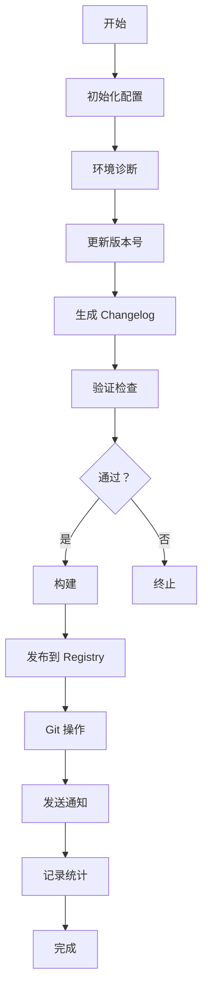

# 简介

@ldesign/publisher 是一个功能强大的企业级 NPM 发布管理工具，旨在简化和自动化整个发布流程。

## 什么是 Publisher？

Publisher 是一个命令行工具，帮助你自动化 NPM 包的发布流程，从版本管理、变更日志生成到发布验证和通知，提供一站式解决方案。

## 核心功能

### 🎯 智能版本管理

基于 [Conventional Commits](https://www.conventionalcommits.org/) 规范自动推荐版本号：

- 自动分析 Git 提交历史
- 智能推荐版本递增（major/minor/patch）
- 支持预发布版本（beta、rc 等）
- 符合 [Semver](https://semver.org/) 规范

### 📝 自动 Changelog

自动生成规范的变更日志：

- 基于 Conventional Commits 解析
- 自动分类（Features、Bug Fixes、Breaking Changes 等）
- 支持 GitHub/GitLab/Gitee/Bitbucket 链接
- 包含作者信息和 PR 链接

### 🔒 多 Registry 支持

灵活的 Registry 管理：

- 支持 NPM 官方 Registry
- 支持私有 Registry
- Scope 级别的 Registry 映射
- 安全的 Token 管理
- 2FA（双因素认证）支持

### 🏢 Monorepo 完整支持

为 Monorepo 项目量身定制：

- 自动检测工作空间
- 依赖关系拓扑排序
- 循环依赖检测和报告
- 批量并行发布
- 自动更新工作空间依赖

### ✅ 全面的发布验证

多重验证确保发布安全：

- Git 状态检查（工作区、分支）
- 包内容验证（必需文件）
- 敏感信息扫描（.env、密钥等）
- 环境检查（Node.js、NPM 版本）
- NPM 凭证验证

### 🔄 发布回滚

完整的回滚支持：

- Unpublish（24小时内）
- Deprecate（废弃版本）
- Git Tag 删除
- 回滚指导和建议

### 🔔 通知系统

实时获取发布状态：

- 钉钉 Webhook
- 企业微信 Webhook
- Slack
- 邮件（SMTP）
- 自定义 Webhook

### 🌟 零配置开始

快速上手：

- `init` 命令交互式生成配置
- 5 个预设模板
- 带注释的配置文件
- 完整的类型提示

### 🩺 环境诊断

自动检测问题：

- 8 项全面检查
- 详细的修复建议
- 表格化展示
- JSON 输出支持

### 🔍 Dry-run 增强

发布前预览：

- 文件列表分析
- 包大小估算
- 7 种问题检测
- 智能优化建议

### 📊 发布统计

完整的历史追踪：

- 自动记录发布历史
- 成功率统计
- 耗时分析
- 趋势预测

### ⚡ 高性能

性能优化：

- 并行处理
- 智能缓存（性能提升 60-70%）
- LRU 缓存策略
- 批量并发发布

## 为什么选择 Publisher？

### 相比手动发布

- ✅ 自动化整个流程
- ✅ 减少人为错误
- ✅ 节省大量时间
- ✅ 统一团队标准

### 相比其他工具

| 特性 | Publisher | Lerna | np | release-it |
|------|-----------|-------|-----|-----------|
| Monorepo 支持 | ✅ 完整 | ✅ | ❌ | 部分 |
| 通知系统 | ✅ 5种渠道 | ❌ | ❌ | 插件 |
| 环境诊断 | ✅ | ❌ | ❌ | ❌ |
| 配置模板 | ✅ 5个 | ❌ | ❌ | ❌ |
| Dry-run 分析 | ✅ 详细 | 基础 | 基础 | 基础 |
| 发布统计 | ✅ | ❌ | ❌ | ❌ |
| 类型安全 | ✅ TS | 部分 | ❌ | 部分 |
| 中文文档 | ✅ 完整 | 部分 | ❌ | ❌ |

## 设计理念

### 1. 简单易用

- 零配置快速开始
- 交互式向导
- 清晰的错误提示
- 完善的文档

### 2. 功能完整

- 覆盖发布全流程
- 企业级功能
- 可扩展性强

### 3. 安全可靠

- 多重验证
- 敏感信息扫描
- Dry-run 预览
- 回滚支持

### 4. 高性能

- 并行处理
- 智能缓存
- 优化算法

### 5. 团队友好

- 通知系统
- 统一标准
- 审计追踪

## 适用场景

### ✅ 适合

- 单包 NPM 项目
- Monorepo 项目
- 开源项目
- 企业内部包
- 需要自动化发布的项目
- 需要团队协作的项目

### ⚠️ 不太适合

- 非 NPM 包（如 Docker 镜像）
- 不需要版本管理的项目
- 一次性发布的包

## 系统要求

- Node.js >= 18.0.0
- pnpm >= 8.0.0（推荐）或 npm/yarn
- Git >= 2.0.0
- NPM 账号（用于发布）

## 工作原理

Publisher 的工作流程：



## 架构概览

```
Publisher
├── CLI Layer          # 命令行接口
├── Core Layer         # 核心管理器
│   ├── PublishManager
│   ├── VersionManager
│   ├── ChangelogGenerator
│   ├── NotificationManager
│   └── ...
├── Validators         # 验证器
├── Utils              # 工具函数
└── Types              # 类型定义
```

## 许可证

[MIT License](https://github.com/ldesign/packages/publisher/blob/main/LICENSE)

## 下一步

- 📖 阅读[快速开始](/guide/getting-started)开始使用
- 🔧 了解[配置选项](/config/overview)
- 💡 查看[最佳实践](/guide/project-setup)
- 🏢 如果使用 Monorepo，查看 [Monorepo 指南](/guide/monorepo)

## 获取帮助

- 💬 [GitHub Issues](https://github.com/ldesign/packages/publisher/issues)
- 📖 [完整文档](/)
- 🔍 使用右上角搜索功能
